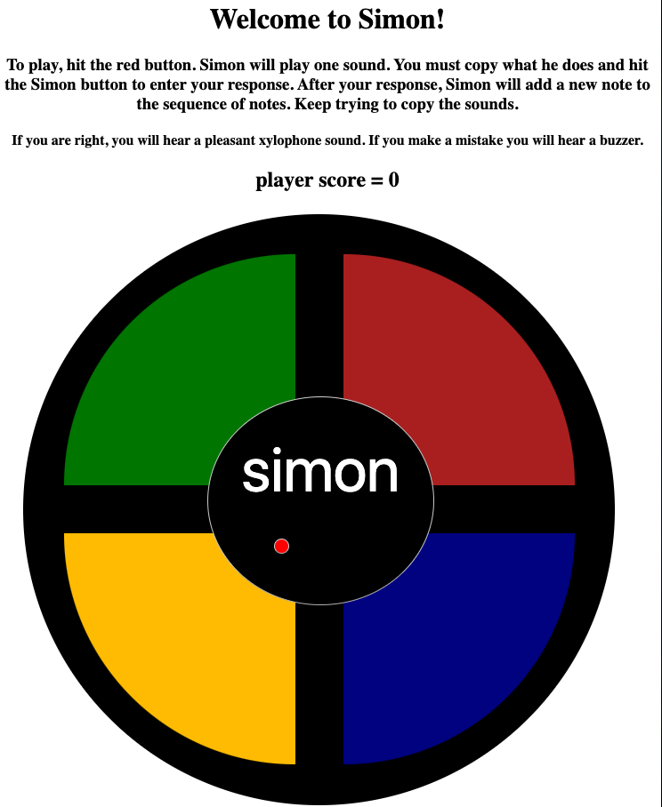

# simon

## (My take on the classic game.)


I decided to tackle this in phases:

## phase 1:
Functionality... 
Create a game board, make the buttons work, add sound and a visual response when buttons are clicked.
## comments: 
This part of the project went so much faster than I anticipated. My process before beginning was to think about what
 I wanted to do for a couple of days, and I'm convinced that time in my head made the output much faster. I used
  photos and video of the original game as reference so I could honor the feel of the game. The fun part of this
   phase was recording the tones on my xylophone. The original game tones were pitched in B-flat, but my xyolophone
    is pitched in the key of C. I modified my tones to match the relative diatonic tones of tonic, mediant, dominant, and the octave above tonic. 
    
   Below is an example of the variables and code used to allow for clicks on each of
     the wedges. Note the use of console.log to confirm output is as expected.
  
  ```javascript
// variables that allow for selection of wedge/button
let pickWedge = document.querySelector('section');
let answerButton = document.querySelector('.enter');
// variables that create the sounds
let pickSoundGreen = new Audio('sounds/green.mp3');
let pickSoundRed = new Audio('sounds/red.mp3');
let pickSoundYellow = new Audio('sounds/yellow.mp3');
let pickSoundBlue = new Audio('sounds/blue.mp3');
let correctSound = new Audio('sounds/gliss-(correct).mp3');
let buzzSound = new Audio('sounds/buzz-(incorrect).mp3');
// variable for computer generated sequences
let computerSequence = [];
//variable for player response
let playerSequence = [];
// allows for the player to select a box/button and the output is visual and auditory.
let option;

// select wedge
pickWedge.addEventListener('click', function (evt) {
    if (evt.target.className === 'wedge-choice1') {
        wedge('.wedge-choice1', '#30bb0b', '#008000', pickSoundGreen);
        option = 0;
    } else if (evt.target.className === 'wedge-choice2') {
        wedge('.wedge-choice2', '#FF0000', '#B22222', pickSoundRed);
        option = 1;
    } else if (evt.target.className === 'wedge-choice3') {
        wedge('.wedge-choice3', '#FFFF00', '#ffc303', pickSoundYellow);
        option = 2;
    } else if (evt.target.className === 'wedge-choice4') {
        wedge('.wedge-choice4', '#0000FF', '#00008B', pickSoundBlue);
        option = 3;
    }
    playerSequence.push(option);
    console.log(playerSequence);
});
```

## phase 2: 
Programming the computer to create a random pattern with the buttons.
## comments:
This part was a bit more tricky and I had some duplicate code, so refactoring as I went deeper into the project
 became very important. My initial idea did work, but because of the nature of JavaScript, all my tones/flashes were
  happening at the same time. This was when I started to use timeout to extend the time between actions. This built
   in function became a critical piece of the project as I continued.
   
   Below is the function I use to generate a random computer sound. 
 ```javascript
function gameStart(time) {
    // trying to add a timeout function to the order of the sounds generated by the loop
    // https://stackoverflow.com/questions/5226285/settimeout-in-for-loop-does-not-print-consecutive-values
    // https://stackoverflow.com/questions/24293376/javascript-for-loop-with-timeout
    for (let i = 1; i <= 1; i++) {
        let random = randomNumberBetween(0, 3);
        setTimeout(() => {
            if (random === 0) {
                wedge('.wedge-choice1', '#30bb0b', '#008000', pickSoundGreen);
            } else if (random === 1) {
                wedge('.wedge-choice2', '#FF0000', '#B22222', pickSoundRed);
            } else if (random === 2) {
                wedge('.wedge-choice3', '#FFFF00', '#ffc303', pickSoundYellow);
            } else if (random === 3) {
                wedge('.wedge-choice4', '#0000FF', '#00008B', pickSoundBlue);
            }
            //   console.log(random);
        }, (time * computerSequence.length) * i);
        computerSequence.push(random);
    }
}
```
## phase 3:
Allowing for turn taking so the computer generates patterns and the user (player) copies them.
This phase will also have a set number of patterns that will determine a "win" case, as well as a "lose" case for
 users unable to recreate the computer pattern.
 ## comments:
 This is where I spent a large chunk of time. I found as I added more elements, I needed to pull apart the initial
  functions and create new functions to run repeat items of code. This was also a place for extensive testing to be
   sure all aspects of game play were running as expected. The hardest part was the comparison between the computer
    and the user because it required a reset of the user array at the end of the turn. Once I figured out how to do that (and
     where to place the code within the function), the game was fully functional within minutes.
     
   Below is the code that made the comparison. Note the commented out ideas that didn't work.
 
 ```javascript
if (playerSequence.length !== computerSequence.length) {
                             buzzSound.play();
                             setTimeout(() => {
                                 document.location.reload();
                             }, 1500);
                         } else {
                             for (let j = 0; j < computerSequence.length; j++) {
                                 if (player.every((value, j) => value === computer[j])) {
                                     //if (player[j] === computer[j]) {
                                     // the direct comparison wasn't working... was returning both sounds.
                                     youAreCorrect();
                                     console.log(player);
                                     console.log(computer);
                                 } else {
                                     buzzSound.play();
                                     setTimeout(() => {
                                         document.location.reload();
                                     }, 1500);
                                 }
                             }
```
 ## phase 4: 
Style the game so it looks awesome!
## comments:
I was surprised how much time I spent working on this. I spent a fair amount of time trying to make the semicircle
 shape out of a trapezoid, before settling on an oval. However, upon reflection and assisting a peer with his css, I
  realized I could create a 1/4 pie shape and layer the simon button on top. I left my notes embedded inside the code
   and all commits have details of the changes I was pushing. 
   
   Below is an example of CSS for one colored wedge.
   ```css
.wedge-choice4 {
    border-left: 40px solid transparent;
    border-right: 40px solid transparent;
    width: 120px;
    display: inline-block;
    flex-direction: row;
    flex-wrap: wrap;
    max-width: 200px;
    height: 200px;
    background-color: darkblue;
    margin-left: 25px;
    margin-top: 50px;
    padding: 30px;
    border-radius: 0 0 300px 0;
}
```

## extensions:
Add scoring and levels 
## comments: 
This final stage took several steps to achieve exactly what I wanted. The 'final' version for quick game play was to
 ensure a win case in a demo. For this case, I created five independent levels that after four tones will level up
 . The level up has less time between computer selections. 
 
 ```javascript
let level1 = 900;
let level2 = 850;
let level3 = 700;
let level4 = 550;
let level5 = 400;

function levelUp() {
    if (totalScore === 4) {
        levelMessage();
        computerSequence.splice(0, computerSequence.length);
        playerSequence.splice(0, playerSequence.length);
        setTimeout(() => {
            gameStart(level2);
            updatePlayerLevel();
        }, 5000);
        console.log(computerSequence);
        console.log(playerSequence);
    } else if (totalScore === 8) {
        levelMessage();
        computerSequence.splice(0, computerSequence.length);
        playerSequence.splice(0, playerSequence.length);
        setTimeout(() => {
            gameStart(level3);
            updatePlayerLevel();
        }, 5000);
    } else if (totalScore === 12) {
        levelMessage();
        computerSequence.splice(0, computerSequence.length);
        playerSequence.splice(0, playerSequence.length);
        setTimeout(() => {
            gameStart(level4);
            updatePlayerLevel();
        }, 5000);
    } else if (totalScore === 16) {
        levelMessage();
        computerSequence.splice(0, computerSequence.length);
        playerSequence.splice(0, playerSequence.length);
        setTimeout(() => {
            gameStart(level5);
            updatePlayerLevel();
        }, 5000);
    }
}
```
 
 The longer play version is much more true to the original spirit of the game and will be purposefully difficult to
  beat. The computer selections will not only get faster, but the number of tones in the sequence required to level
   up will increase exponentially.
  
  ## future additions:
  I may return to this project to add a way for users to enter their high scores. I think it would be fun to see who
   is playing this game (and where in the world they are playing it). Also, if too many are winning that level 5, maybe I will make it even more challenging!

## access and info:
This project was completed using HTML, CSS, and JavaScript. All code created by Sarah Panaligan. Please submit
 comments and fixes through the [issues](https://github.com/spianoDev/simon/issues) tab on this repository. Forks
  welcome, but since this is a portfolio piece, pull requests will not be considered at this time.

You can play the game via my website: [spiano.dev](https://www.spiano.dev/simon/).

